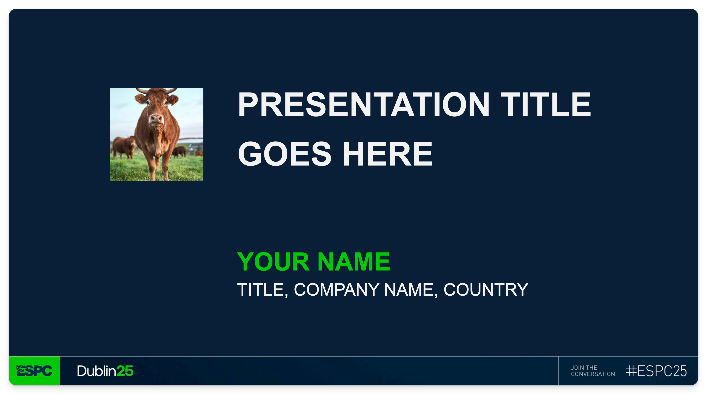

# ESPC25 Presentation Template for Demo Time

This repository contains a presentation template specifically designed for Demo Time sessions at ESPC25. The template is derived from the official ESPC25 presentation template, with modifications to suit the unique requirements of [Demo Time](https://demotime.show/) presentations.



## Slides

All the [slide layouts](https://demotime.show/slides/layouts/) from Demo Time are included in this template.

There is also a custom slide layout for the title slide and it can be used as follows:

```markdown
---
customLayout: .demo/layout/title.html
image: .demo/assets/background.webp
# Change the following metadata values
title: PRESENTATION TITLE GOES HERE
name: YOUR NAME
meta: TITLE, COMPANY NAME, COUNTRY
profileImg: .demo/assets/profile.png
---

```

## Theme colors

To use the theme, you need to set the `theme` metadata value to either `espc` or `espc light` at the beginning of your markdown file, like so:

```markdown
---
theme: espc light
---
```

> [!CAUTION]
> You are not able to mix dark and light slides in the same markdown slide group. If you want to use both dark and light slides, you need to create separate markdown slide groups for each. An example can be found in the [dark template](.demo/slides/template.md) and [light template](.demo/slides/template-light.md).